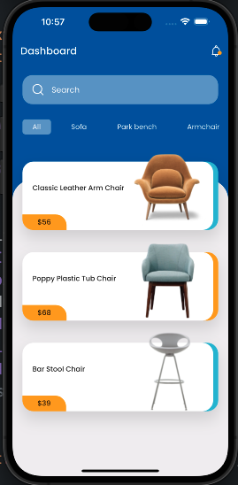
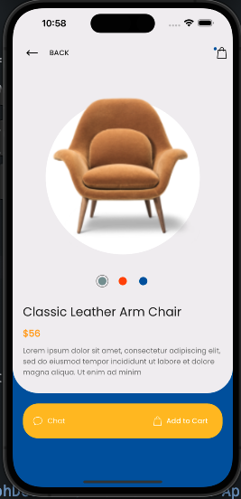
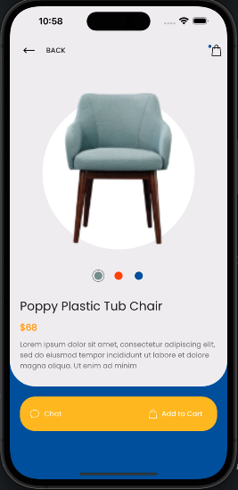

# Flutter Furniture App UI

Design Credits: The Flutter Way
[View on Github](https://github.com/abuanwar072/furniture_app_flutter)

## Description

Welcome to the Furniture App UI! This Flutter-based mobile application provides users with a sleek and intuitive interface to explore and shop for various furniture items. Whether you're looking for sofas, tables, chairs, or decorative pieces, our app has got you covered.

## Features

- Browse through a wide range of furniture items.
- View detailed product information and images.
- Search for specific items using the search functionality.
- Add items to your cart for future purchase.
- Smooth and responsive user interface.

## Screenshots





## Getting Started

Follow the steps below to set up the project on your local machine and run it:

1. Clone the repository:

```bash
git clone https://github.com/JosephDoUrden/Furniture-App-UI
cd Furniture-App-UI/
flutter run
```

## Contact

If you have any questions, feedback, or would like to connect, feel free to reach out to me.

- **Name:** Yusufhan Saçak
- **Email:** yusufhan.sacak@bahcesehir.edu.tr
- **Website:** https://medium.com/@yusufhansacak
- **Twitter:** [@0xSCK](https://twitter.com/0xSCK)
- **LinkedIn:** [Yusufhan Saçak](https://www.linkedin.com/in/yusufhansacak/)

Feel free to contact me through any of the channels above. I'm open to collaborations and discussions related to Flutter development or any other projects.
